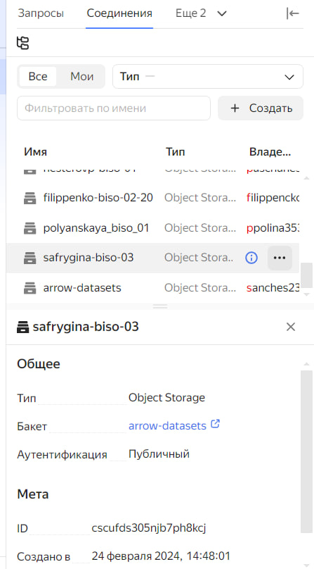
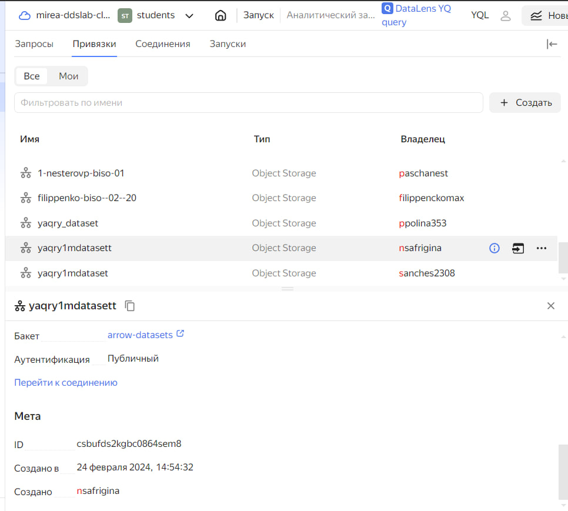
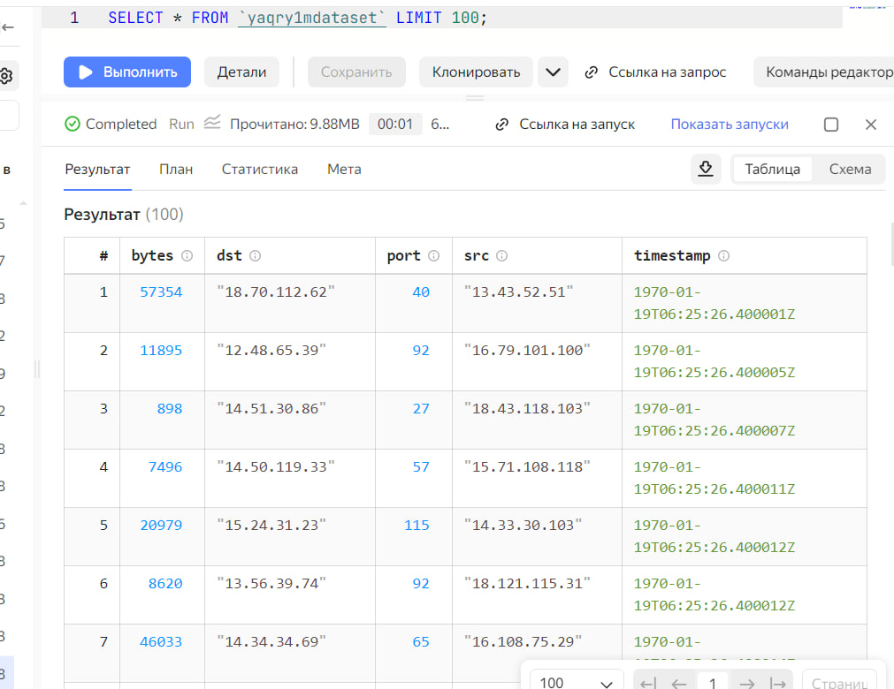
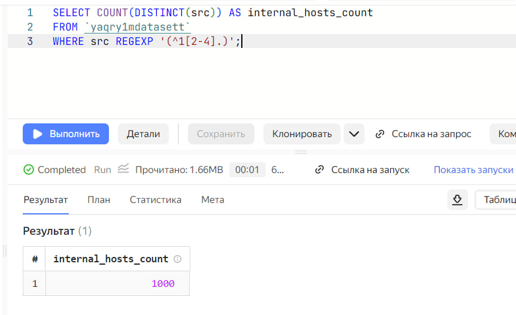
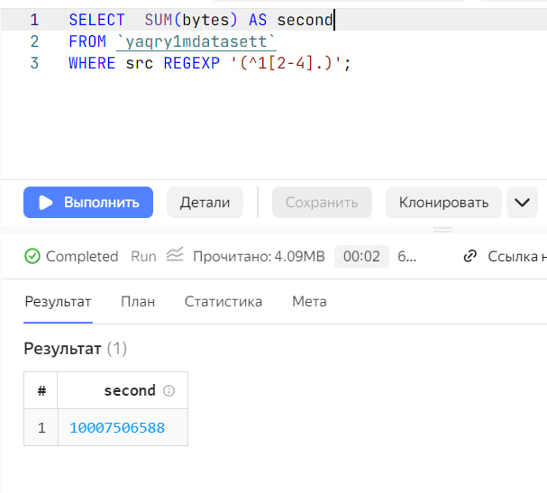
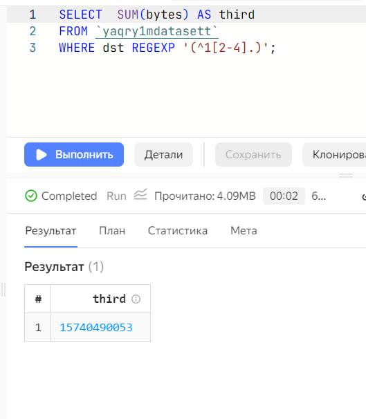

# Использование технологии Yandex Query для анализа данных сетевой
активности
Сафрыгина Анастасия

## Цель работы

1.  Изучить возможности технологии Yandex Query для анализа
    структурированных наборов данных
2.  Получить навыки построения аналитического пайплайна для анализа
    данных с помощью сервисов Yandex Cloud
3.  Закрепить практические навыки использования SQL для анализа данных
    сетевой активности в сегментированной корпоративной сети

## Исходные данные

1.  ОС Windows
2.  Cервисы Yandex Cloud
3.  RStudio

## План

1.  Проверить доступность данных в Yandex Object Storage
2.  Подключить бакет как источник данных для Yandex Query
3.  Анализ
4.  Отчет

<!-- ## Описание шагов: -->

1.  **Проверьте доступность данных в Yandex Object Storage** Проверьте
    доступность данных (файл yaqry_dataset.pqt) в *бакете*
    arrow-datasets S3 хранилища Yandex Object Storage. Проверить можно
    просто перейдя по правильно сконструированному URL в браузере.

    <https://storage.yandexcloud.net/arrow-datasets/yaqry_dataset.pqt>

2.  **Подключить бакет как источник данных для Yandex Query**

**Yandex Query** – это облачное решение для анализа данных, в котором
задачи организации хранения, обеспечения доступа и выполнения первичного
анализа данных полностью берет на себя сервис-провайдер, то есть Yandex
Cloud.

1.  Создать соединение для бакета в S3 хранилище.

    

2.  Теперь, после создания соединения, укажем какой объект использовать
    в качестве источника данных. Для этого нужно сделать привязку
    данных.

    

Формат данных  
SCHEMA=( timestamp TIMESTAMP NOT NULL, src STRING, dst STRING, port
INT32, bytes INT32 )

-   Если настройки сделаны правильно, то можно попробовать сделать
    аналитический запрос и посмотреть результат

    

1.  **Провести анализ данных**

**1 Известно, что IP адреса внутренней сети начинаются с октетов,
принадлежащих интервалу \[12-14\]. Определите количество хостов
внутренней сети, представленных в датасете.**

Запрос

    SELECT COUNT(DISTINCT(src)) AS internal_hosts_count
    FROM `yaqry1mdatasett`
    WHERE src REGEXP '(^1[2-4].)';

Ответ: 1000

    

**2 Определите суммарный объем исходящего трафика**

Запрос

    SELECT  SUM(bytes) AS second
    FROM `yaqry1mdatasett`
    WHERE src REGEXP '(^1[2-4].)';

Ответ: 10007506588 байт

    

**3 Определите суммарный объем входящего трафика**

Запрос

    SELECT  SUM(bytes) AS third
    FROM `yaqry1mdatasett`
    WHERE dst REGEXP '(^1[2-4].)';

Ответ: 15740490053 байт

    

## Оценка результатов

Задача выполнена при помощи облачных сервисов Yandex Cloud и технологии
Yandex Query, удалось познакомиться с их функционалом и особенностями.

## Вывод

В данной работе я закрепила практические навыки использования SQL для
анализа данных сетевой активности в сегментированной корпоративной сети
и получила навыки построения аналитического пайплайна для анализа данных
